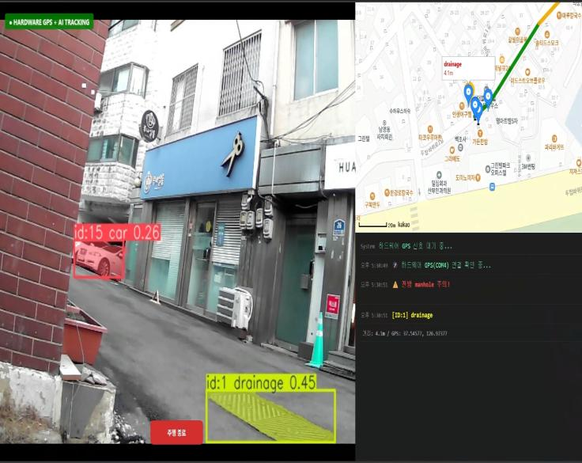
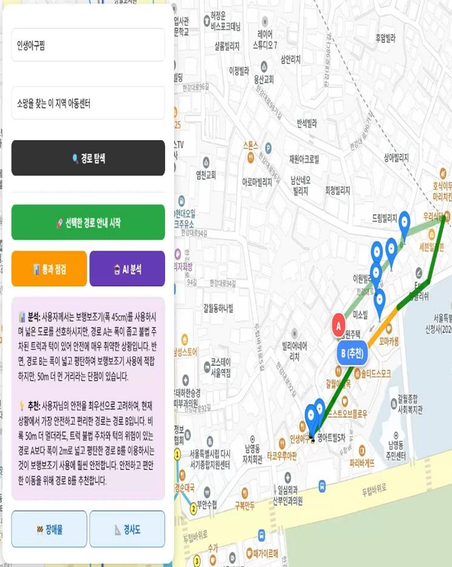

<div align="center">

## 🗺️ MOS-Map-of-Safety

# M.O.S: Map of Safety

보행자·교통약자 대상 실시간 위험 감지 및 안전 경로 추천

</div>

---

## 🧭 Project Overview

**Task:** 보행 중 위험 요소 감지 · 지도 기반 경로 추천

**Components:** OSMnx 도보 경로 · YOLO/NCNN 객체 탐지 · IPM 거리 추정 · Gemini 위험 분석 · Flask API

---

## 📷 Demo

| 실버카 프로토타입 | 객체 탐지 · GPS 추적 | 경로 안전성 분석 |
|:---:|:---:|:---:|
|  |  |  |

---

## ✨ Features

- OSMnx 기반 도보 경로 계산
- 경로 캐싱을 통한 반복 실행 최적화
- Flask 기반 로직 서버
- YOLO 기반 실시간 객체 탐지
- NCNN 모델 기반 Edge 추론 지원
- IPM 기반 픽셀 좌표 → 실제 거리 변환
- PathPlanner 기반 통과 가능성 판단
- Gemini 기반 위험 분석 및 경로 추천
- 웹 UI 연동을 위한 API 제공

---

## 🛠️ Tech Stack

- Python
- Flask
- OpenCV
- YOLO / Ultralytics
- NCNN
- OSMnx
- NetworkX
- Gemini API
- HTML / CSS / JavaScript
- Jupyter Notebook

---

## 📁 Directory Structure

```text
MOS-Map-of-Safety/
│
├─ Data_Processing/
│   └─ data preprocessing codes
│
├─ edge_sensing/
│   └─ edge sensing and runtime codes
│
├─ logic server/
│   ├─ app.py
│   ├─ path_planner.py
│   ├─ gemini_reasoner.py
│   ├─ ipm_transform.py
│   ├─ id_lock_tracker.py
│   └─ shared_mem_manager.py
│
├─ mapping_ui/
│   ├─ map_engine.py
│   ├─ templates/
│   └─ static/
│
├─ requirement.txt
└─ README.md
```
